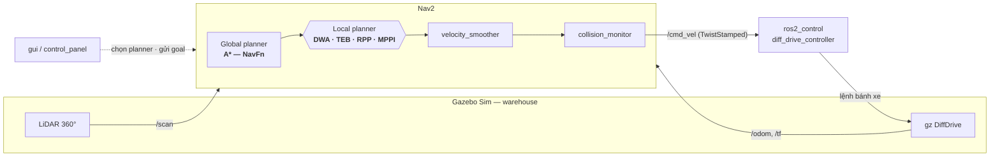

<div align="center">

# Đánh giá & So sánh Thuật toán Điều hướng Cục bộ cho Robot Tự hành

**Hệ thống mô phỏng đơn robot trên ROS 2 · Nav2 — khảo sát bốn thuật toán điều khiển cục bộ**
**DWA · TEB · RPP · MPPI** trên cùng một global planner **A\***

<br/>


-FA6607?style=flat-square&logo=gazebo&logoColor=white)


</div>

---

> **Tóm tắt.** Điều hướng cục bộ (*local planning*) là thành phần quyết định
> chất lượng chuyển động của robot tự hành: nó biến đường đi toàn cục thành
> lệnh vận tốc thời gian thực, tránh vật cản và tôn trọng ràng buộc động học.
> Repo này xây dựng một **bàn thử nghiệm có kiểm soát** để so sánh khách quan
> bốn thuật toán local planner phổ biến của Nav2 — **DWA, TEB, RPP, MPPI** —
> bằng cách cố định toàn bộ điều kiện (robot, bản đồ, global planner A\*, ràng
> buộc vận tốc) và chỉ thay đổi *biến độc lập* là thuật toán đang xét. Người
> dùng chuyển đổi giữa các thuật toán ngay trên giao diện đồ hoạ.

## Mục lục

1. [Giới thiệu & Động lực](#1-giới-thiệu--động-lực)
2. [Kiến trúc hệ thống](#2-kiến-trúc-hệ-thống)
3. [Các thuật toán khảo sát](#3-các-thuật-toán-khảo-sát)
4. [Thiết lập thực nghiệm](#4-thiết-lập-thực-nghiệm)
5. [Cấu trúc mã nguồn](#5-cấu-trúc-mã-nguồn)
6. [Cài đặt & biên dịch](#6-cài-đặt--biên-dịch)
7. [Hướng dẫn sử dụng](#7-hướng-dẫn-sử-dụng)
8. [Cấu hình & tinh chỉnh](#8-cấu-hình--tinh-chỉnh)
9. [Khắc phục sự cố](#9-khắc-phục-sự-cố)
10. [Tài liệu tham khảo](#10-tài-liệu-tham-khảo)

---

## 1. Giới thiệu & Động lực

Trong kiến trúc điều hướng hai tầng của Nav2, **global planner** tìm một đường
đi khả thi trên bản đồ tĩnh, còn **local planner** (controller) chịu trách
nhiệm bám đường đó theo thời gian thực: sinh lệnh vận tốc, né vật cản động và
tuân thủ giới hạn động học của robot. Cùng một đường đi toàn cục, những
local planner khác nhau cho ra hành vi rất khác nhau về tốc độ, độ mượt, độ an
toàn và khả năng vượt góc hẹp.

**Vấn đề:** việc so sánh các thuật toán thường không công bằng vì mỗi thuật
toán được thử trong điều kiện khác nhau (bản đồ, tốc độ tối đa, robot…).

**Mục tiêu của repo:** cung cấp một môi trường **có kiểm soát** để đánh giá,
nơi mọi yếu tố được giữ cố định và chỉ local planner thay đổi — nhờ đó mọi
khác biệt quan sát được quy về đúng thuật toán, không phải điều kiện chạy.

| | |
|---|---|
| **Biến độc lập** | Thuật toán local planner: DWA · TEB · RPP · MPPI |
| **Biến kiểm soát** | Robot, bản đồ, global planner (A\*), trần vận tốc/gia tốc, tần số điều khiển, dung sai đích |
| **Biến phụ thuộc** | Hành vi chuyển động: thời gian tới đích, độ mượt, khoảng cách tới vật cản, khả năng vượt góc |

---

## 2. Kiến trúc hệ thống

Toàn bộ ngăn xếp điều hướng dùng chung; **chỉ khối local planner được hoán đổi**
giữa bốn thuật toán:



| Tầng | Thành phần | Vai trò |
|---|---|---|
| Cảm biến | LiDAR 2D, odometry | `/scan`, `/odom`, `/tf` đầu vào cho costmap & định vị |
| Định vị | AMCL / `slam_toolbox` | Ước lượng pose trong khung `map` |
| Quy hoạch toàn cục | `nav2_navfn_planner` (A\*) | Đường đi tối ưu trên bản đồ tĩnh |
| **Điều khiển cục bộ** | **DWA / TEB / RPP / MPPI** | **Sinh vận tốc bám đường (đối tượng khảo sát)** |
| Hậu xử lý | `velocity_smoother`, `collision_monitor` | Làm mượt & chặn va chạm trước khi ra `/cmd_vel` |
| Chấp hành | `ros2_control` `diff_drive_controller` | Chuyển `/cmd_vel` (TwistStamped) thành lệnh bánh |

---

## 3. Các thuật toán khảo sát

Bốn tệp cấu hình Nav2 **giống hệt nhau**, chỉ khác khối `controller_server.FollowPath`:

| Thuật toán | Plugin (`FollowPath`) | Cấu hình | Nguyên lý |
|---|---|---|---|
| **DWA** | `dwb_core::DWBLocalPlanner` | [`nav2_dwb.yaml`](src/main_bot/config/nav2_dwb.yaml) | *Dynamic Window* — lấy mẫu không gian vận tốc khả thi, chấm điểm từng quỹ đạo bằng tập *critics* |
| **TEB** | `teb_local_planner::TebLocalPlannerROS` | [`nav2_teb.yaml`](src/main_bot/config/nav2_teb.yaml) | *Timed Elastic Band* — tối ưu đồ thị pose theo thời gian/khoảng cách/ràng buộc bằng g2o |
| **RPP** | `nav2_regulated_pure_pursuit_controller::…` | [`nav2_rpp.yaml`](src/main_bot/config/nav2_rpp.yaml) | *Regulated Pure Pursuit* — bám điểm nhìn trước, tự giảm tốc theo độ cong & cost |
| **MPPI** | `nav2_mppi_controller::MPPIController` | [`nav2_mppi.yaml`](src/main_bot/config/nav2_mppi.yaml) | *Model Predictive Path Integral* — lấy mẫu ngẫu nhiên hàng nghìn quỹ đạo, lấy trung bình theo trọng số chi phí |

> Chi tiết công bố gốc của từng thuật toán: xem [§10 Tài liệu tham khảo](#10-tài-liệu-tham-khảo).

---

## 4. Thiết lập thực nghiệm

### 4.1 Mô hình robot

Robot vi sai (*differential drive*) hai bánh chủ động + bánh tự lựa:

| Thông số | Giá trị |
|---|---|
| Kích thước thân (D×R×C) | 0.320 × 0.240 × 0.078 m |
| Bán kính / bề dày bánh | 0.05 m / 0.026 m |
| Khoảng cách hai bánh | 0.266 m |
| Bán kính ngoại tiếp | 0.20 m (`√(0.16² + 0.12²)`) |
| Cảm biến | LiDAR 2D: 360 tia, 10 Hz, tầm 0.08–10 m, FOV 360° |
| Điều khiển | `ros2_control` `diff_drive_controller` (nhận `TwistStamped`) |

### 4.2 Môi trường & bản đồ

- **Thế giới mô phỏng:** [`worlds/warehouse.sdf`](src/main_bot/worlds/warehouse.sdf) — nhà kho có kệ hàng, lối đi hẹp (đo được ~0.95 m tính từ tâm tới tường).
- **Bản đồ:** [`maps/warehouse.yaml`](src/main_bot/maps/warehouse.yaml), độ phân giải 0.05 m/ô.
- **Định vị:** AMCL trên bản đồ đã lưu, hoặc `slam_toolbox` để dựng bản đồ mới.

### 4.3 Biến kiểm soát (giữ cố định giữa các thuật toán)

Đây là điều làm cho phép so sánh có giá trị — mọi tham số dưới đây **đồng nhất**
trên cả bốn tệp `nav2_*.yaml`:

| Tham số | Giá trị | Ghi chú |
|---|---|---|
| Global planner | A\* (`NavfnPlanner`, `use_astar: true`) | Đường đi toàn cục như nhau cho mọi thuật toán |
| Trần vận tốc | 0.5 m/s · 1.9 rad/s | Không thuật toán nào được cấp tốc độ cao hơn |
| Trần gia tốc | 2.5 m/s² · 3.2 rad/s² | Khớp giới hạn `diff_drive_controller` |
| `robot_radius` | 0.20 m | Bán kính ngoại tiếp chassis |
| `inflation_radius` | 0.30 m | `robot_radius` + ~50% đệm |
| `cost_scaling_factor` | 2.5 | Giữ cost cao xa tường → đi giữa lối, bớt cắt góc |
| `controller_frequency` | 20 Hz | Tần số vòng điều khiển |
| Dung sai đích | 0.25 m · 0.25 rad | Điều kiện coi như "tới đích" |

---

## 5. Cấu trúc mã nguồn

```
tap-diff/
└── src/
    ├── main_bot/                  # Gói lõi: mô tả robot, launch, config, world, map
    │   ├── description/           #   URDF/Xacro (chassis, LiDAR, ros2_control)
    │   ├── config/                #   nav2_{dwb,teb,rpp,mppi}.yaml · controllers · slam
    │   ├── launch/                #   gz · slam · nav2 · rz (rviz)
    │   └── worlds/ · maps/ · rviz/
    ├── gui/                       # Bảng điều khiển Tkinter (control_panel)
    ├── teb_local_planner/         # TEB (vendored — cần g2o lúc biên dịch)
    └── costmap_converter/         # Phụ thuộc của TEB (vendored)
```

---

## 6. Cài đặt & biên dịch

**Yêu cầu:** Ubuntu 24.04 · ROS 2 Jazzy · Gazebo Sim 8 (Harmonic) + `ros_gz` ·
`nav2_bringup` · `slam_toolbox`.

```bash
sudo apt install ros-jazzy-nav2-bringup ros-jazzy-slam-toolbox ros-jazzy-ros-gz \
     ros-jazzy-nav2-dwb-controller \
     ros-jazzy-nav2-regulated-pure-pursuit-controller \
     ros-jazzy-nav2-mppi-controller
```

> **⚠️ g2o cho TEB.** `teb_local_planner` liên kết với **g2o** lúc biên dịch.
> Máy này không có `ros-jazzy-libg2o` toàn cục; g2o được cài tay tại
> `~/.local/ros-extra-deps/opt/ros/jazzy`. Phải đưa prefix đó vào
> `CMAKE_PREFIX_PATH`, nếu không quá trình build dừng ở `Could not find libg2o!`.

```bash
git clone <repo-url> tap-diff && cd tap-diff

# g2o prefix cho TEB (chỉ cần lúc build) — cân nhắc thêm vào ~/.bashrc
export CMAKE_PREFIX_PATH=/home/dvt/.local/ros-extra-deps/opt/ros/jazzy:$CMAKE_PREFIX_PATH

colcon build
source install/setup.bash
```

---

## 7. Hướng dẫn sử dụng

### 7.1 Qua giao diện đồ hoạ (khuyến nghị)

```bash
ros2 run gui control_panel
```

Quy trình trên bảng điều khiển:

1. **Simulation** → *Gazebo* (mở world) · *SLAM* (hoặc dùng bản đồ có sẵn) · *RViz* (quan sát).
2. **Local planner (global: A\*)** → chọn **DWA / TEB / RPP / MPPI** (loại trừ lẫn nhau — bấm cái mới sẽ dừng cái cũ để không tranh `/cmd_vel`).
3. Gửi đích bằng công cụ **Nav2 Goal** trên RViz.
4. **Điều khiển thủ công** → joystick teleop (publish thẳng `/cmd_vel`).

### 7.2 Qua dòng lệnh

```bash
ros2 launch main_bot gz.launch.py            # Gazebo + robot
ros2 launch main_bot slam.launch.py          # (tuỳ chọn) dựng bản đồ
ros2 launch main_bot rz.launch.py            # RViz (cấu hình nav2_view)

# Chọn một trong bốn thuật toán:
ros2 launch main_bot nav2.launch.py \
    params_file:=$(ros2 pkg prefix main_bot)/share/main_bot/config/nav2_mppi.yaml
```

---

## 8. Cấu hình & tinh chỉnh

- Tham số **dùng chung** (giữ cố định để so sánh) — xem [§4.3](#43-biến-kiểm-soát-giữ-cố-định-giữa-các-thuật-toán).
- Tham số **riêng từng thuật toán** — chỉnh trong khối `FollowPath` của tệp
  `nav2_<x>.yaml` tương ứng.
- Giao thức vận tốc: robot dùng `diff_drive_controller` chỉ nhận `TwistStamped`,
  nên toàn bộ pipeline (`controller_server`, `velocity_smoother`,
  `collision_monitor`…) đặt `enable_stamped_cmd_vel: true`.

---

## 9. Khắc phục sự cố

| Triệu chứng | Nguyên nhân & xử lý |
|---|---|
| Build dừng `Could not find libg2o!` | Thiếu g2o prefix — xem [§6](#6-cài-đặt--biên-dịch). |
| RViz/Gazebo crash `__libc_pthread_init` | Biến `GTK_PATH` do snap của VS Code chèn; các launch đã `UnsetEnvironmentVariable('GTK_PATH')` — chạy từ terminal ngoài nếu vẫn lỗi. |
| Nav2 crash SIGSEGV khi nạp bản đồ | Đã đặt `use_composition:=False` (bringup dạng composed lỗi ImageMagick). |
| Teleop không làm robot chạy | `/cmd_vel` là `TwistStamped`; publisher `Twist` sẽ bị ROS bỏ qua âm thầm do lệch kiểu. |
| Robot ì / đi sát tường | Đã tinh chỉnh gia tốc (2.5/3.2) và `cost_scaling` (2.5); tinh chỉnh thêm trong `nav2_<x>.yaml` nếu cần. |

---

## 10. Tài liệu tham khảo

1. **DWA** — D. Fox, W. Burgard, S. Thrun, *"The Dynamic Window Approach to Collision Avoidance,"* IEEE Robotics & Automation Magazine, 1997.
2. **TEB** — C. Rösmann et al., *"Trajectory Modification Considering Dynamic Constraints of Autonomous Robots,"* ROBOTIK, 2012; *"Efficient Trajectory Optimization Using a Sparse Model,"* ECMR, 2013.
3. **RPP** — S. Macenski, S. Singh, F. Martín, J. Ginés, *"Regulated Pure Pursuit for Robot Path Tracking,"* Autonomous Robots, 2023.
4. **MPPI** — G. Williams et al., *"Model Predictive Path Integral Control: From Theory to Parallel Computation,"* Journal of Guidance, Control, and Dynamics, 2017.
5. **Nav2** — S. Macenski et al., *"The Marathon 2: A Navigation System,"* IROS, 2020. — [docs.nav2.org](https://docs.nav2.org)

<div align="center">
<sub>Xây dựng trên ROS 2 Jazzy · Nav2 · Gazebo Sim — phục vụ nghiên cứu & so sánh thuật toán điều hướng.</sub>
</div>
